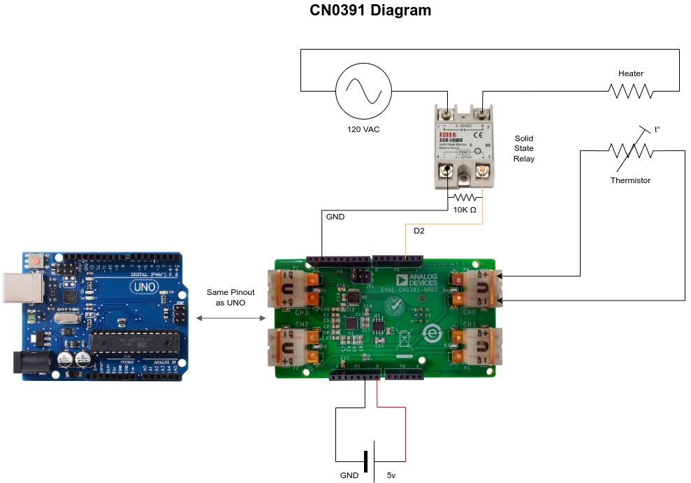
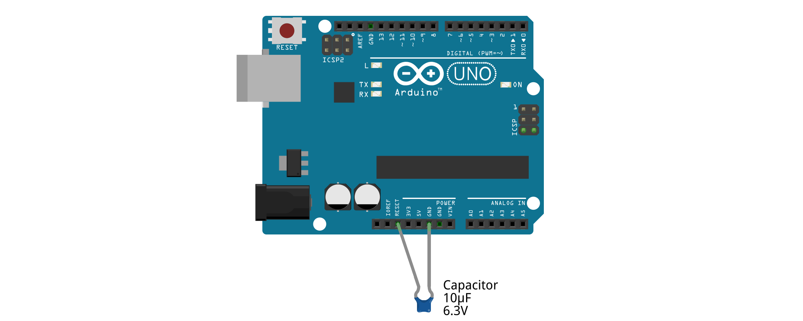

# Arduino Temperature Controller
This repository contains a large Arduino sketch and a set of Python scripts that create a temperature controller using the _CN-0391 sensor shield_. The sketch and the Python scripts are meant to run in unison. Once the sketch is uploaded to the Arduino, the Python script communicates with the Arduino via serial to plot the data measured by the Temperature shield. The sketch is designed such that it can control up to four different devices and accurately control their temperature. Each port in the temperature shield can be connected to a thermistor to complete the circuit for maintaining a target temperature.

## Dependencies
The code requires the following external dependencies:

**Arduino:**
- None. All the code is included locally and simply needs to be uploaded to an _Arduino Uno_ or a similar board with an _ATmega328P_ microcontroller.

**Python:** The scripts were written with _Python 3.11_ and will work with _Python 3.12_. They require the following libraries that can be installed using **pip**:

```bash
pip install numpy==2.3.0
pip install pyserial==3.5
pip install matplotlib==3.10.3
```

## How to run the software
To run the software follow these steps:

1. Open the folder `arduino` and upload the sketch `arduino.ino` to the board using the Arduino IDE.
2. Open a terminal on Unix-based systems or use IDLE (included with Python) on Windows, and run the script `main.py` inside the python folder with the command:

```bash
python3 main.py
```


## Serial Communication API 
Serial API to interface directly with the Arduino is based on a comma delimited string of the form:

```
<function>,<channel>,<value1>,<value2>, .... <valueN>
```

Each element in the string encodes the following information:

- `<command>` is a positive integer that indicates a specific function. 
- `<channel>` is a positive integer that indicates for which device the function will be applied to.
- The remaining `<values>` are _decimal_ numbers that act as the input parameters for aforementioned function.  

The values for each function and each channel are shown in the table below:

| CHANNEL | FUNCTION           | VALUE |
| ------- | ------------------ | ----- |
| CH0     | GET_FILTER         | 0     |
| CH1     | GET_RAW            | 1     |
| CH2     | GET_TARGET         | 2     |
| CH3     | SET_TARGET         | 3     |
| CH_ALL  | GET_PID            | 4     |
|         | SET_PID            | 5     |
|         | GET_IN_LIMIT       | 6     |
|         | SET_IN_LIMIT       | 7     |
|         | GET_AB_FILTER      | 8     |
|         | SET_AB_FILTER      | 9     |
|         | GET_K_FILTER       | 10    |
|         | SET_K_FILTER       | 11    |
|         | SET_K_FILTER_STATE | 12    |
|         | GET_SENSOR_TYPE    | 13    |
|         | SET_ENABLE         | 14    |
|         | SET_DISABLE        | 15    |
|         | GET_ENABLE         | 16    |
|         | GET_TIMER          | 17    |
|         | GET_TIMEOUT        | 18    |
|         | SET_TIMEOUT        | 19    |

Based on this table its possible to combine the numbers to access a specific function. For example,
to set the _target temperature_ on _channel 1_ to **45 degrees** celsius, the command is:

```
3,1,45
```

Likewise, to set the _PID coefficients_ on _channel 3_, with **kp=10**, **ki=0.1**, and **kd=20**, 
one can provide:

```
5,1,10,0.1,20
```

Whenever a command has been successfully received, the Arduino will reply with the name of the 
function that was executed as it appears in the table. In the above example, one shall receive:

```
SET_PID
```

Should the command not be on the list, or if it passed with an incorrect number of parameters,
the Arduino will reply with the following error message:

```
BAD_COMMAND
```

The parameters for each function are available through the documentation for the Python API. 

## Python API
The serial commands can also be called via a Python API to execute the functions in an orderly and
verbose manner. Each function show in the table has an equivalent function in the `TempControllerCN0391` 
class. For more details, see the documentation for the modules:

- [TempControllerCN0391](python/html/TempControllerCN0391.html) : Contains list of parameters for both Serial and Python API
- [ArduinoSerial](python/html/ArduinoSerial.html)
- [KeyboardThread](python/html/KeyboardThread.html)
- [main](python/html/main.html) : Interactive plot program


## Power Control
The user can choose which digital output pins on the Arduino will be used to control a solid-state relay or a MOSFET. The Arduino activates the chosen electrical switch using a modified pulse-frequecy modulation (PFM) wave, controlling the average power dissipated by the heating element and precisely controlling the temperature.

This precise control is achieved through a PID controller that employs an alpha-beta filter to smooth raw temperature sensor measurements and obtain a low-noise approximation of the derivative of the temperature. Depending on the thermal inertia of the object being controlled, and the underlying system's time constant, the software can achieve precision of **~0.5 degrees Celsius** near the target temperature. This will depend on the noise of the sensor attached to the temperature shield, as some sensors have more noise than others.

By using the serial interface to view raw temperature measurements and manually fine-tuning the PID and filter coefficients loaded onto the Arduino, it is possible to accurately control the temperature of an object with acceptable overshoot and response time.


## Configuring PID Controllers and Signal Filters
### Controller:
The temperature controllers utilize individual PID controllers to reach a target temperature. These controllers have three primary parameters that determine their behavior:

- **GAIN_P (Proportional Coefficient):** The proportional coefficient influences the response of the controller based on the measured temperature. A larger value causes the controller to inject heat into the system when the temperature is lower than the setpoint. It plays a significant role in controlling the temperature.

- **GAIN_I (Integral Coefficient):** The integral coefficient determines the magnitude of the time integral of the error between the target temperature and the measured temperature. This term eliminates any long-term, steady-state error at the cost of greater overshoot and ringing in the step response.

- **GAIN_D (Derivative Coefficient):** The derivative coefficient determines the magnitude of the time derivative of the measured temperature. This term is highly sensitive to noise in the measured temperature and is influenced significantly by the coefficients chosen for the Alpha-Beta filter. When tuned correctly, it damps the response of the controller, slowing its reactions while removing ringing from the system. However, if too large, it can cause high-frequency oscillations or instability.

- **MIN and MAX:** These are the saturation limits of a PID controller that clamps its output to avoid integral windup, wherein the integral term cannot change if the output of the controller is saturated.

### Filters:
The Alpha/Beta coefficients smooth raw temperature readings and are part of the PID controller. This filter is essential in reducing noise in the derivative term.

- **ALPHA:** This coefficient smooths any abrupt changes in the raw measurements. A value closer to zero causes a slower but smoother response. Constraints: `0 <= ALPHA <= 1`

- **BETA:** This is the derivative filter. It increases the delay and overshoot in the signal response due to ALPHA, causing a phase delay between the real derivative and smoothed estimate. A value closer to zero causes a smoother and more delayed response. Constraints: `0 <= BETA <= 1`

The Kalman Filter modifies the Arduino's serial output and requires two coefficients:

- **ERROR:** If the filter's value is within this error band relative to the unfiltered value, the filter will respond very slowly to any changes in the raw signal. This is equivalent to the standard deviation of the unfiltered signal. In other words, measurements within this error band are suppressed.

- **NOISE:** This coefficient determines the general response of the filter. A larger number makes the filter react more quickly to changes in the raw signal. A smaller value makes the filter react more slowly. A smaller value also smooths out any fluctuations in the raw signal at the cost of response time. Constraints: `0 <= NOISE <= 1`

_Note:_ Different sensor types can be connected to the CN-0391. These sensors are physically distinct, and they require unique calibration parameters to accurately measure temperature. The user must identify the type of sensor they are using, either through documentation or by comparing the output of CN-0391 with another temperature sensor that is accurately calibrated.


## Circuit
The Arduino should be connected to a 5V power supply, and the heating elements should be connected to a solid-state relay (SSR) and an alternating current (AC) source. The SSR must be connected in series between the power source and a heating element. Note that the input side of the SSR module should be connected to the ground of the 5V supply and to one of the digital output pins on the Arduino. The input to the SSR can be attached to any digital pin that is enabled through software. See the attached schematic: 



Due to how Arduinos are electrically connected, they will reset whenever a new serial communication is established. There is no straightforward method to prevent this behavior with software. To avoid this issue, add a small capacitor between the reset pin and ground on the Arduino. Alternatively, cut the traces that connect to the reset pin to permanently disable it; however, this interferes with uploading new firmware to the Arduino. For an easier solution, physically connect a capacitor to the Arduino _after_ firmware is loaded and remove the capacitor _before_ reprogramming it.



In practice, this behavior means that whenever a serial connection is lost and reestablished, the Arduino will reset and a new target temperature must be specified. This discontinuity could cause the device being controlled by the Arduino to experience a significant change in temperature.


## References

**Filters**:   

- [Alpha Beta Filter](https://en.wikipedia.org/wiki/Alpha_beta_filter) 

- [Arduino - 1D Kalman Filter](https://github.com/denyssene/SimpleKalmanFilter)

- [Kalman Filter for 1D Motion with Acceleration and Bias](https://cookierobotics.com/072/)

**Signals**:   

- [Pulse Frequency Modulation (PFM)](https://en.wikipedia.org/wiki/Pulse-frequency_modulation)

**Hardware**:   

- [Analog Systems CN-0391 Module](https://wiki.analog.com/resources/eval/user-guides/Arduino-uno/reference_designs/demo_cn0391)

- [Disable Arduino Auto-Reset](https://www.astroscopic.com/blog/disable-Arduinos-auto-reset-connection)

**Documentation**:   

The python modules were documented automatically by embedding the function descriptions into the 
code using **docstrings**, and then scanning the `.py` files with **pdoc3** to generate fully
styled **HTML** pages. 
For more details, see:

- [pdoc3](https://pdoc3.github.io/pdoc/) - Light weight documentation generator for python
- [numpydoc](https://numpydoc.readthedocs.io/en/latest/format.html) - Style guide for docstrings

